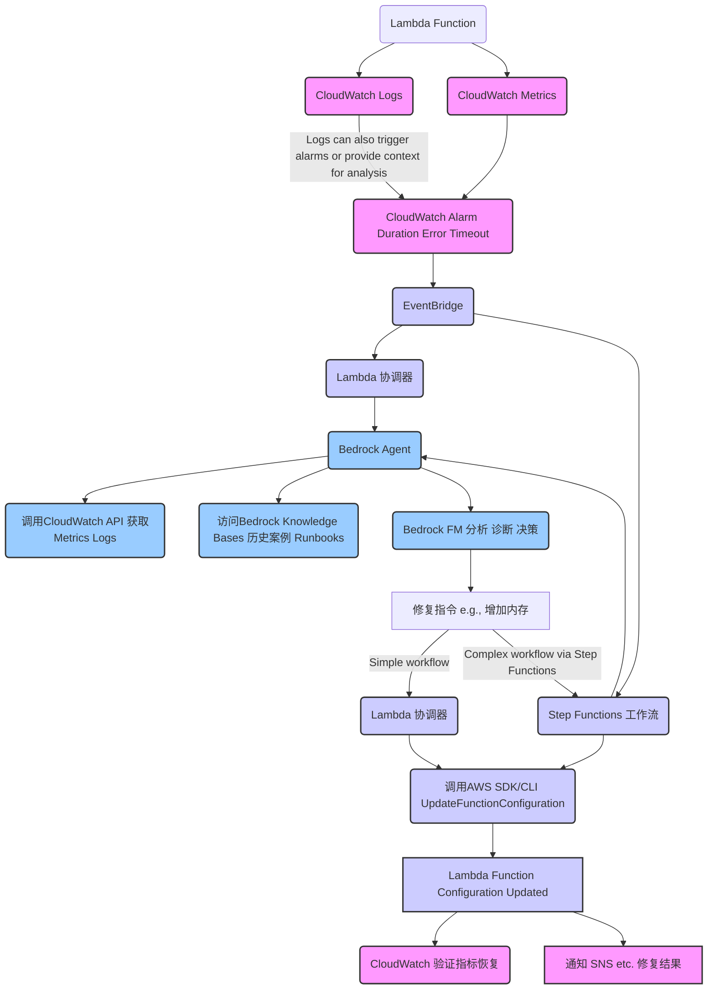

# Design Document: Lambda 服务异常的自动化修复系统

## Overview

本设计文档详细描述了一个自动化系统，用于检测、诊断和修复 AWS Lambda 函数中由内存不足导致的性能问题。系统采用闭环设计，从异常检测到智能诊断再到自动修复，最后验证修复效果并通知相关人员。系统利用 AWS 原生服务（如 CloudWatch、EventBridge、Step Functions）结合 Amazon Bedrock 的 AI 能力，实现智能化的问题诊断和自动化修复。

## Architecture

系统架构采用事件驱动、微服务和无服务器架构相结合的方式，主要包含以下几个核心组件：

1. **监控与告警子系统**：基于 CloudWatch 实现对 Lambda 函数关键指标的监控和告警
2. **事件处理与编排子系统**：基于 EventBridge 和 Step Functions 实现事件路由和工作流编排
3. **智能诊断子系统**：基于 Amazon Bedrock 实现对异常原因的智能分析和诊断
4. **自动修复子系统**：基于 Lambda 函数实现对目标 Lambda 配置的自动修改
5. **验证与通知子系统**：基于 CloudWatch 和 SNS 实现修复效果验证和结果通知

### 系统架构图



## Components and Interfaces

### 1. 监控与告警子系统

#### 组件描述
- **CloudWatch Metrics Collector**：收集 Lambda 函数的关键性能指标
- **CloudWatch Logs Analyzer**：分析 Lambda 函数的日志内容
- **Anomaly Detection Alarm**：基于异常检测算法的告警机制

#### 接口定义
- **指标收集接口**：
  ```json
  {
    "functionName": "string",
    "metrics": ["Duration", "Errors", "Throttles", "IteratorAge", "ConcurrentExecutions"],
    "period": "number",
    "statistic": "string"
  }
  ```
- **告警配置接口**：
  ```json
  {
    "alarmName": "string",
    "metricName": "string",
    "threshold": "number",
    "evaluationPeriods": "number",
    "datapointsToAlarm": "number",
    "comparisonOperator": "string",
    "treatMissingData": "string"
  }
  ```### 2. 事件处
理与编排子系统

#### 组件描述
- **EventBridge Router**：根据事件类型路由到相应处理流程
- **Lambda Coordinator**：处理简单流程的协调器函数
- **Step Functions Workflow**：处理复杂流程的状态机

#### 接口定义
- **事件格式**：
  ```json
  {
    "source": "aws.cloudwatch",
    "detail-type": "CloudWatch Alarm State Change",
    "resources": ["arn:aws:cloudwatch:region:account-id:alarm:alarm-name"],
    "detail": {
      "alarmName": "string",
      "state": {
        "value": "string",
        "reason": "string"
      },
      "configuration": {
        "metrics": [
          {
            "id": "string",
            "metricStat": {
              "metric": {
                "namespace": "string",
                "name": "string",
                "dimensions": {
                  "FunctionName": "string"
                }
              },
              "period": "number",
              "stat": "string"
            }
          }
        ]
      }
    }
  }
  ```
- **Step Functions 状态机定义**（简化版）：
  ```json
  {
    "Comment": "Lambda Auto-Repair Workflow",
    "StartAt": "CollectMetricsAndLogs",
    "States": {
      "CollectMetricsAndLogs": {
        "Type": "Task",
        "Resource": "arn:aws:states:::lambda:invoke",
        "Next": "DiagnoseIssue"
      },
      "DiagnoseIssue": {
        "Type": "Task",
        "Resource": "arn:aws:states:::bedrock:invokeAgent",
        "Next": "DetermineAction"
      },
      "DetermineAction": {
        "Type": "Choice",
        "Choices": [
          {
            "Variable": "$.diagnosisResult.isMemoryIssue",
            "BooleanEquals": true,
            "Next": "ExecuteRepair"
          }
        ],
        "Default": "NotifyNoAction"
      },
      "ExecuteRepair": {
        "Type": "Task",
        "Resource": "arn:aws:states:::lambda:invoke",
        "Next": "VerifyRepair"
      },
      "VerifyRepair": {
        "Type": "Task",
        "Resource": "arn:aws:states:::lambda:invoke",
        "Next": "NotifyResult"
      },
      "NotifyNoAction": {
        "Type": "Task",
        "Resource": "arn:aws:states:::sns:publish",
        "End": true
      },
      "NotifyResult": {
        "Type": "Task",
        "Resource": "arn:aws:states:::sns:publish",
        "End": true
      }
    }
  }
  ```#
## 3. 智能诊断子系统

#### 组件描述
- **Metrics & Logs Collector**：收集告警相关的指标和日志数据
- **Bedrock Knowledge Base**：存储 Lambda 性能问题相关知识
- **Bedrock Agent**：执行智能诊断和决策的代理
- **Bedrock Foundation Model**：提供智能分析和推理能力

#### 接口定义
- **诊断请求格式**：
  ```json
  {
    "functionName": "string",
    "alarmDetails": {
      "alarmName": "string",
      "metricName": "string",
      "threshold": "number",
      "evaluationPeriods": "number"
    },
    "metrics": [
      {
        "timestamp": "string",
        "value": "number"
      }
    ],
    "logs": [
      {
        "timestamp": "string",
        "message": "string"
      }
    ]
  }
  ```
- **诊断结果格式**：
  ```json
  {
    "isMemoryIssue": "boolean",
    "confidence": "number",
    "reasoning": "string",
    "recommendedAction": "string",
    "recommendedMemoryIncrease": "number",
    "evidencePoints": [
      {
        "type": "string",
        "description": "string"
      }
    ]
  }
  ```

### 4. 自动修复子系统

#### 组件描述
- **Repair Executor**：执行修复操作的 Lambda 函数
- **Configuration Manager**：管理 Lambda 函数配置的组件
- **Audit Logger**：记录修复操作的审计日志

#### 接口定义
- **修复请求格式**：
  ```json
  {
    "functionName": "string",
    "memoryIncrease": "number",
    "maxMemory": "number",
    "dryRun": "boolean"
  }
  ```
- **修复结果格式**：
  ```json
  {
    "functionName": "string",
    "originalMemory": "number",
    "newMemory": "number",
    "status": "string",
    "timestamp": "string",
    "executionId": "string"
  }
  ```### 
5. 验证与通知子系统

#### 组件描述
- **Repair Verifier**：验证修复效果的组件
- **SNS Notifier**：发送通知的组件
- **Metrics Comparator**：比较修复前后指标变化的组件

#### 接口定义
- **验证请求格式**：
  ```json
  {
    "functionName": "string",
    "repairTimestamp": "string",
    "metricName": "string",
    "verificationPeriod": "number"
  }
  ```
- **通知格式**：
  ```json
  {
    "type": "string",
    "functionName": "string",
    "issue": {
      "description": "string",
      "alarmName": "string",
      "detectedAt": "string"
    },
    "diagnosis": {
      "result": "string",
      "confidence": "number",
      "reasoning": "string"
    },
    "repair": {
      "action": "string",
      "originalMemory": "number",
      "newMemory": "number",
      "executedAt": "string"
    },
    "verification": {
      "status": "string",
      "metricsComparison": {
        "before": "number",
        "after": "number",
        "improvement": "string"
      }
    }
  }
  ```

## Data Models

### 1. Lambda 函数配置模型

```json
{
  "functionName": "string",
  "runtime": "string",
  "memorySize": "number",
  "timeout": "number",
  "environment": {
    "variables": {
      "key": "value"
    }
  },
  "tags": {
    "key": "value"
  },
  "lastModified": "string",
  "lastModifiedBy": "string"
}
```

### 2. 告警事件模型

```json
{
  "alarmId": "string",
  "alarmName": "string",
  "functionName": "string",
  "metricName": "string",
  "threshold": "number",
  "currentValue": "number",
  "stateChangeTime": "string",
  "previousState": "string",
  "currentState": "string",
  "stateReason": "string"
}
```### 3
. 诊断记录模型

```json
{
  "diagnosisId": "string",
  "functionName": "string",
  "alarmId": "string",
  "startTime": "string",
  "endTime": "string",
  "isMemoryIssue": "boolean",
  "confidence": "number",
  "reasoning": "string",
  "recommendedAction": "string",
  "recommendedMemoryIncrease": "number",
  "evidencePoints": [
    {
      "type": "string",
      "description": "string"
    }
  ],
  "knowledgeReferences": [
    {
      "id": "string",
      "title": "string",
      "relevance": "number"
    }
  ]
}
```

### 4. 修复记录模型

```json
{
  "repairId": "string",
  "functionName": "string",
  "diagnosisId": "string",
  "executionId": "string",
  "startTime": "string",
  "endTime": "string",
  "originalMemory": "number",
  "newMemory": "number",
  "status": "string",
  "verificationStatus": "string",
  "notificationStatus": "string"
}
```

### 5. 知识库条目模型

```json
{
  "entryId": "string",
  "title": "string",
  "category": "string",
  "content": "string",
  "source": "string",
  "tags": ["string"],
  "createdAt": "string",
  "updatedAt": "string",
  "version": "string",
  "approvedBy": "string"
}
```

## Error Handling

### 1. 监控与告警错误处理

- **指标收集失败**：记录错误日志，设置默认阈值，定期重试
- **告警配置错误**：提供验证机制，使用默认配置，通知管理员

### 2. 事件处理错误处理

- **事件格式错误**：记录错误日志，丢弃无效事件，通知管理员
- **路由失败**：使用默认路由规则，记录错误日志
- **Step Functions 执行失败**：实现重试机制，记录错误状态，通知管理员### 3.
 智能诊断错误处理

- **数据收集失败**：使用可用数据继续诊断，标记数据不完整
- **Bedrock API 调用失败**：实现重试机制，降级到基于规则的诊断
- **诊断结果置信度低**：要求人工审核，提供详细的不确定性原因

### 4. 自动修复错误处理

- **API 调用失败**：记录错误日志，实现重试机制，通知管理员
- **权限不足**：记录错误日志，请求临时权限，通知管理员
- **配置验证失败**：回滚修改，记录错误日志，通知管理员

### 5. 验证与通知错误处理

- **验证数据不足**：延长验证期，标记验证结果为不确定
- **通知发送失败**：实现重试机制，使用备用通知渠道
- **验证结果不明确**：请求人工审核，提供详细的验证数据

## Testing Strategy

### 1. 单元测试

- **监控组件测试**：验证指标收集和告警触发逻辑
- **事件处理测试**：验证事件路由和工作流定义
- **诊断逻辑测试**：验证基于不同输入的诊断结果
- **修复执行测试**：验证配置修改逻辑（使用模拟 API）
- **验证逻辑测试**：验证指标比较和结果判断逻辑

### 2. 集成测试

- **监控到事件流测试**：验证从指标异常到事件生成的流程
- **事件到诊断流测试**：验证从事件接收到诊断执行的流程
- **诊断到修复流测试**：验证从诊断结果到修复执行的流程
- **修复到验证流测试**：验证从修复执行到结果验证的流程
- **端到端流程测试**：验证完整的异常检测到通知的流程### 3.
 模拟测试

- **异常场景模拟**：模拟不同类型的 Lambda 性能异常
- **Bedrock 响应模拟**：模拟不同的 Bedrock 诊断结果
- **API 错误模拟**：模拟各种 API 调用错误和异常
- **验证场景模拟**：模拟不同的修复后验证场景

### 4. 负载测试

- **并发告警处理测试**：验证系统处理多个并发告警的能力
- **诊断性能测试**：验证诊断子系统的响应时间和吞吐量
- **修复执行性能测试**：验证修复子系统的响应时间和吞吐量

### 5. 安全测试

- **权限验证测试**：验证最小权限原则的实施
- **数据加密测试**：验证敏感数据的加密机制
- **审计日志测试**：验证审计日志的完整性和准确性

## 部署架构

系统将采用 AWS CloudFormation 或 AWS CDK 进行基础设施即代码（IaC）部署，主要包含以下资源：

1. **CloudWatch 资源**：
   - 指标和日志组
   - 告警配置
   - 异常检测规则

2. **EventBridge 资源**：
   - 事件总线
   - 事件规则
   - 目标配置

3. **Lambda 资源**：
   - 协调器函数
   - 数据收集函数
   - 修复执行函数
   - 验证函数

4. **Step Functions 资源**：
   - 状态机定义
   - IAM 角色和策略

5. **Bedrock 资源**：
   - Knowledge Base 配置
   - Agent 配置
   - 模型访问权限

6. **SNS 资源**：
   - 通知主题
   - 订阅配置

7. **IAM 资源**：
   - 服务角色
   - 权限策略
   - 跨服务访问配置

8. **DynamoDB 资源**（可选）：
   - 诊断记录表
   - 修复记录表
   - 审计日志表## 安全考虑


1. **最小权限原则**：
   - 每个组件使用专用 IAM 角色
   - 权限范围限制在必要的操作和资源
   - 使用条件键进一步限制权限

2. **数据安全**：
   - 传输中加密（使用 HTTPS/TLS）
   - 存储中加密（使用 AWS KMS）
   - 敏感信息处理（避免日志记录敏感数据）

3. **审计与合规**：
   - 详细的审计日志记录所有操作
   - CloudTrail 跟踪 API 调用
   - 定期权限审查机制

4. **批准机制**：
   - 关键环境的修复需要人工批准
   - 使用 Step Functions 的人工批准任务
   - 批准流程的审计记录

## 扩展性考虑

1. **支持更多异常类型**：
   - 设计可扩展的诊断框架
   - 模块化的知识库结构
   - 可配置的修复策略

2. **多区域支持**：
   - 区域特定配置
   - 跨区域事件路由
   - 集中式管理界面

3. **自定义修复策略**：
   - 可配置的修复规则
   - 环境特定的修复策略
   - 渐进式修复选项

4. **集成其他 AWS 服务**：
   - 与 AWS Config 集成
   - 与 AWS Systems Manager 集成
   - 与 AWS Organizations 集成