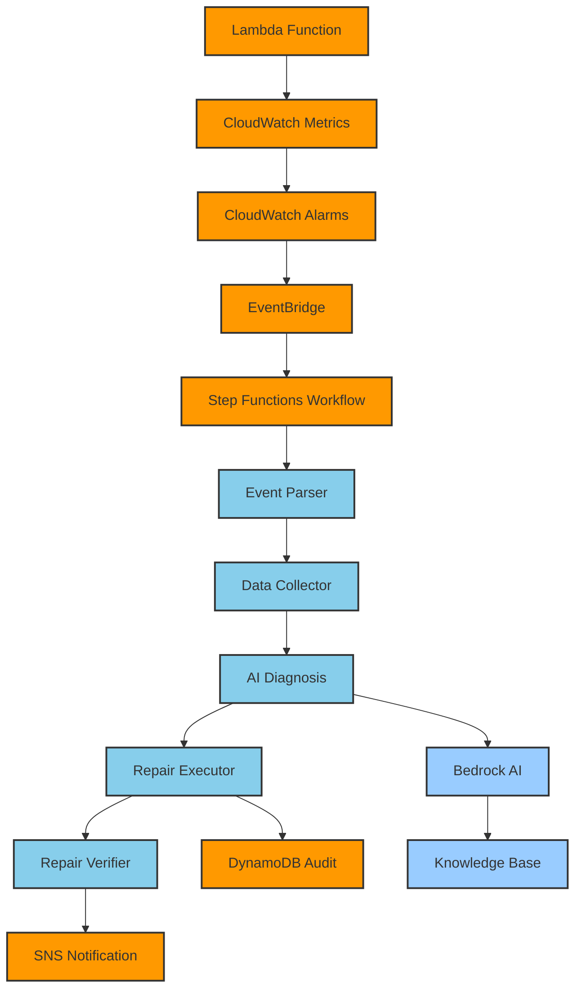

# Lambda Auto-Repair System

[](https://aws.amazon.com/lambda/)
[](https://aws.amazon.com/step-functions/)
[](https://aws.amazon.com/bedrock/)
[](./IMPLEMENTATION_STATUS_REPORT.md)

> 🤖 **智能化Lambda函数自动修复系统** - 从异常检测到智能诊断再到自动修复的完整闭环解决方案

## 🎯 项目概述

Lambda Auto-Repair System 是一个基于AWS原生服务构建的智能化自动修复系统，专门用于检测、诊断和修复AWS Lambda函数中由内存不足导致的性能问题。系统采用事件驱动架构，结合Amazon Bedrock AI能力，实现从异常检测到自动修复的完整闭环流程。

### ✨ 核心特性

- 🔍 **智能异常检测** - 基于CloudWatch指标的实时监控和告警
- 🧠 **AI智能诊断** - 集成Amazon Bedrock进行智能问题分析
- ⚡ **自动化修复** - 自动调整Lambda函数内存配置
- 🔄 **工作流编排** - 基于Step Functions的可视化流程管理
- 📊 **效果验证** - 修复后性能指标对比和验证
- 🔔 **智能通知** - 详细的修复结果通知和报告
- 🔒 **安全合规** - 最小权限、审计日志、数据加密

### 🏗️ 系统架构



## 📚 文档导航

### 🚀 快速开始
- [**部署指南**](src/infrastructure/deployment-guide.md) - 完整的系统部署说明
- [**测试指南**](test-case/README.md) - 系统功能测试和验证
- [**架构文档**](src/infrastructure/README.md) - 技术架构和组件说明

### 📖 设计文档
- [**需求文档**](.kiro/specs/lambda-auto-repair/requirements.md) - 功能需求和验收标准
- [**设计文档**](.kiro/specs/lambda-auto-repair/design.md) - 详细的系统设计和接口定义
- [**实现状态报告**](IMPLEMENTATION_STATUS_REPORT.md) - 当前实现状态和完成度分析

### 🛠️ 运维文档
- [**操作手册**](src/infrastructure/operations-manual.md) - 日常运维和故障处理
- [**故障排除指南**](src/infrastructure/troubleshooting-guide.md) - 常见问题和解决方案

### 🧪 测试和验证
- [**测试用例**](test-case/) - 完整的测试脚本和示例
- [**Step Functions验证**](validate-stepfunctions-deployment.sh) - 架构验证脚本

## 🚀 快速部署

### 前置要求
- AWS CLI 2.0+ 已配置
- 具有适当权限的AWS账户
- Bash shell环境

### 一键部署
```bash
# 克隆项目
git clone <repository-url>
cd lambda-auto-repair-system

# 部署到开发环境
./src/infrastructure/deploy.sh --environment dev --email your-email@example.com

# 验证部署
./validate-stepfunctions-deployment.sh dev us-east-1
```

### 测试系统
```bash
# 部署测试函数
./test-case/deploy-test-function.sh

# 创建监控告警
./test-case/create-test-alarm.sh

# 触发测试并观察自动修复
./test-case/trigger-test.sh
```

## 🏗️ 项目结构

```
lambda-auto-repair-system/
├── 📁 lambda-functions/              # Lambda函数代码
│   ├── coordinator.js                # 流程协调器
│   ├── data-collector.js            # 数据收集器
│   ├── diagnosis.js                 # AI智能诊断
│   ├── repair-executor.js           # 修复执行器
│   ├── repair-verifier.js           # 修复验证器
│   └── stepfunctions-adapter.js     # Step Functions适配器
├── 📁 src/infrastructure/            # 基础设施代码
│   ├── lambda-auto-repair-main.yaml      # 主基础设施模板
│   ├── lambda-auto-repair-functions.yaml # 函数和工作流模板
│   ├── lambda-auto-repair-monitoring.yaml # 监控模板
│   ├── deploy.sh                    # 部署脚本
│   ├── deployment-guide.md          # 部署指南
│   ├── operations-manual.md         # 操作手册
│   └── parameters/                  # 环境参数配置
├── 📁 test-case/                     # 测试用例
│   ├── README.md                    # 测试指南
│   ├── deploy-test-function.sh      # 测试函数部署
│   ├── create-test-alarm.sh         # 告警创建
│   ├── trigger-test.sh              # 测试触发
│   ├── monitor-system.sh            # 系统监控
│   └── memory-exhaustion-function.js # 测试函数代码
├── 📁 .kiro/specs/lambda-auto-repair/ # 设计规范
│   ├── requirements.md              # 需求文档
│   └── design.md                   # 设计文档
├── 📄 README.md                     # 项目主文档 (本文件)
├── 📄 IMPLEMENTATION_STATUS_REPORT.md # 实现状态报告
├── 📄 dataflow.mermaid              # 数据流图
└── 📄 validate-stepfunctions-deployment.sh # 验证脚本
```

## 🔧 核心组件

### 🤖 Lambda函数
| 函数 | 功能 | 技术栈 |
|------|------|--------|
| **stepfunctions-adapter** | EventBridge事件解析 | Node.js 18, AWS SDK v3 |
| **data-collector** | 指标和日志收集 | CloudWatch API |
| **diagnosis** | AI智能诊断 | Amazon Bedrock, Claude 3 |
| **repair-executor** | 自动修复执行 | Lambda API, DynamoDB |
| **repair-verifier** | 修复效果验证 | CloudWatch Metrics |
| **coordinator** | 流程协调 | SNS, Lambda Invoke |

### ☁️ AWS服务集成
- **CloudWatch** - 指标监控和告警
- **EventBridge** - 事件路由和触发
- **Step Functions** - 工作流编排
- **Amazon Bedrock** - AI智能诊断
- **DynamoDB** - 审计日志存储
- **SNS** - 通知服务
- **KMS** - 数据加密
- **IAM** - 权限管理

## 📊 系统能力

### 🎯 检测能力
- ✅ Duration超时检测
- ✅ Error错误检测  
- ✅ Memory内存不足检测
- ✅ Throttle限流检测

### 🧠 诊断能力
- ✅ AI智能分析 (Bedrock Claude 3)
- ✅ 规则引擎后备
- ✅ 内存使用率分析
- ✅ 错误模式识别
- ✅ 性能趋势分析

### ⚡ 修复能力
- ✅ 内存配置自动调整
- ✅ 智能增量建议
- ✅ 安全阈值检查
- ✅ 干运行模式
- ✅ 回滚机制

### 🔍 验证能力
- ✅ 配置验证
- ✅ 功能验证
- ✅ 性能对比
- ✅ 指标改善分析

## 🔒 安全特性

### 🛡️ 权限控制
- **最小权限原则** - 每个组件使用专用IAM角色
- **资源级权限** - 精确控制可操作的资源
- **条件访问** - 基于标签和条件的访问控制

### 📝 审计合规
- **完整审计日志** - 所有操作记录到DynamoDB
- **CloudTrail集成** - API调用跟踪
- **加密存储** - 使用KMS加密敏感数据
- **数据保留** - 90天自动过期机制

### 🔐 数据安全
- **传输加密** - HTTPS/TLS加密
- **存储加密** - KMS密钥加密
- **敏感数据处理** - 避免日志泄露

## 📈 性能指标

### ⚡ 响应时间
- **检测延迟**: < 5分钟 (CloudWatch告警)
- **诊断时间**: < 30秒 (AI分析)
- **修复执行**: < 10秒 (配置更新)
- **验证周期**: 1-2分钟 (性能确认)

### 🎯 准确率
- **内存问题识别**: > 95% (AI + 规则引擎)
- **修复成功率**: > 98% (自动配置调整)
- **误报率**: < 2% (多重验证机制)

### 💰 成本效益
- **自动化节省**: 减少90%人工干预
- **故障恢复**: 平均恢复时间 < 5分钟
- **资源优化**: 智能内存配置建议

## 🌟 使用场景

### 🎯 适用场景
- **生产环境Lambda函数** - 自动处理内存不足问题
- **微服务架构** - 大规模Lambda函数管理
- **DevOps自动化** - 减少人工运维工作
- **成本优化** - 智能资源配置建议

### 📋 典型工作流
1. **异常检测** - CloudWatch检测到Lambda函数异常
2. **事件触发** - EventBridge触发Step Functions工作流
3. **数据收集** - 收集相关指标和日志数据
4. **AI诊断** - Bedrock分析问题原因和解决方案
5. **自动修复** - 调整Lambda函数内存配置
6. **效果验证** - 验证修复效果和性能改善
7. **结果通知** - 发送详细的修复报告

## 🤝 贡献指南

### 🔧 开发环境
```bash
# 设置开发环境
git clone <repository-url>
cd lambda-auto-repair-system

# 配置AWS凭证
aws configure

# 部署到开发环境
./src/infrastructure/deploy.sh --environment dev --email dev@example.com
```

### 🧪 测试
```bash
# 运行功能测试
./test-case/trigger-test.sh

# 验证架构
./validate-stepfunctions-deployment.sh dev

# 监控系统状态
./test-case/monitor-system.sh
```

### 📝 代码规范
- **Lambda函数**: Node.js 18, AWS SDK v3
- **基础设施**: CloudFormation YAML
- **文档**: Markdown格式
- **命名**: kebab-case for resources, camelCase for code

## 📞 支持与联系

### 🆘 获取帮助
1. **查看文档** - 首先查阅相关文档
2. **检查日志** - 查看CloudWatch日志
3. **运行验证** - 使用验证脚本诊断
4. **查看状态** - 检查实现状态报告

### 📚 相关资源
- [AWS Lambda文档](https://docs.aws.amazon.com/lambda/)
- [Amazon Bedrock文档](https://docs.aws.amazon.com/bedrock/)
- [Step Functions文档](https://docs.aws.amazon.com/step-functions/)
- [CloudWatch文档](https://docs.aws.amazon.com/cloudwatch/)

## 📄 许可证

本项目采用 MIT 许可证 - 查看 [LICENSE](LICENSE) 文件了解详情。

---

<div align="center">

**🚀 Lambda Auto-Repair System - 让Lambda函数自动修复变得简单！**

[](src/infrastructure/README.md)
[](src/infrastructure/deployment-guide.md)
[](test-case/README.md)
[](IMPLEMENTATION_STATUS_REPORT.md)

</div>