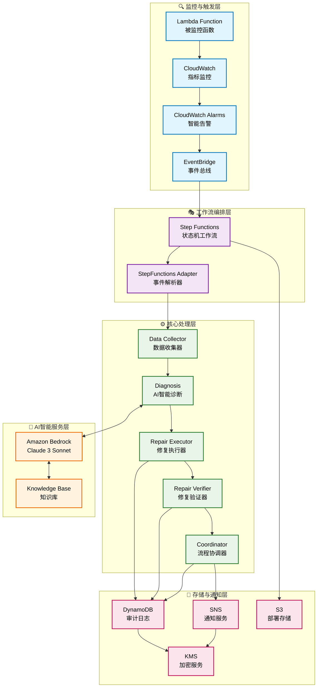
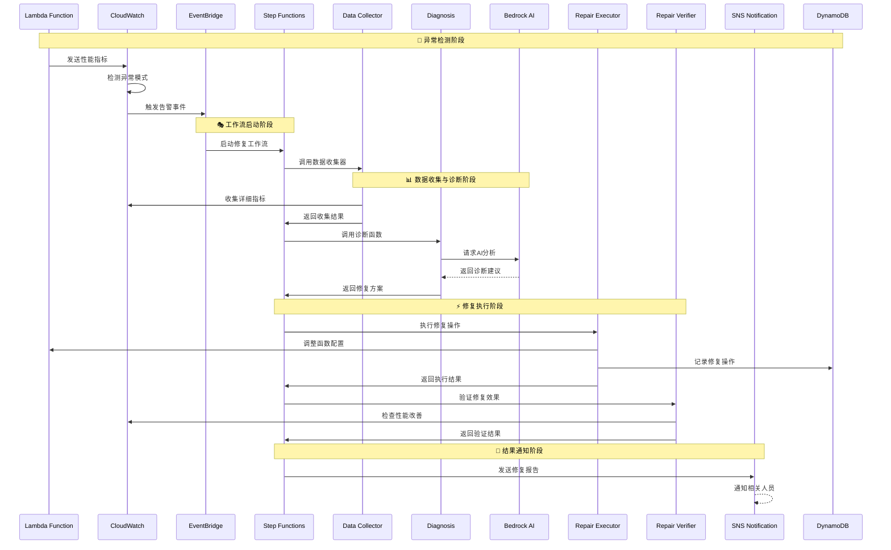
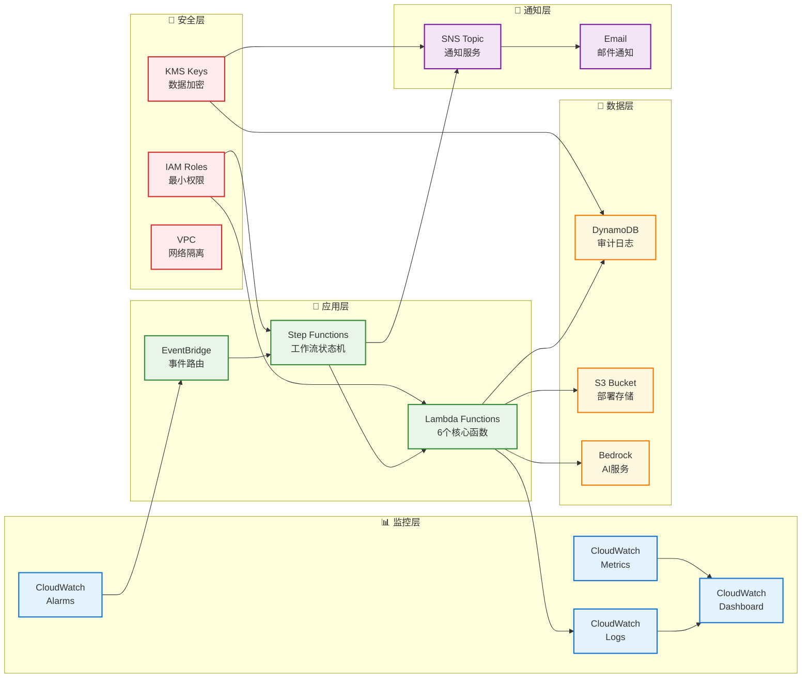

# Lambda自动修复系统 - 基础设施即代码

本目录包含Lambda自动修复系统的基础设施即代码(IaC)模板和部署脚本。

## 概述

Lambda自动修复系统使用AWS CloudFormation模板部署，组织为三个主要堆栈：

1. **主基础设施** (`lambda-auto-repair-main.yaml`) - 核心资源如S3、KMS、SNS、EventBridge和DynamoDB
2. **函数和工作流** (`lambda-auto-repair-functions.yaml`) - Lambda函数、Step Functions和EventBridge规则
3. **监控和告警** (`lambda-auto-repair-monitoring.yaml`) - CloudWatch仪表板、告警和自定义指标

## 系统架构

### 🏗️ 整体架构图



### 🔄 详细工作流程图



### 🏛️ 基础设施架构图



## 前置要求

- 已配置适当权限的AWS CLI
- jq (用于验证脚本中的JSON处理)
- Bash shell环境

### 所需AWS权限

部署需要以下AWS权限：

- CloudFormation: 堆栈管理的完全访问权限
- IAM: 创建和管理角色和策略
- Lambda: 创建和管理函数
- Step Functions: 创建和管理状态机
- EventBridge: 创建和管理事件总线和规则
- CloudWatch: 创建和管理告警、仪表板和日志组
- SNS: 创建和管理主题和订阅
- DynamoDB: 创建和管理表
- S3: 创建和管理存储桶
- KMS: 创建和管理加密密钥
- Bedrock: 访问模型和知识库

## 快速开始

### 1. 部署到开发环境

```bash
./deploy.sh --environment dev --email your-email@example.com
```

### 2. 部署到生产环境

```bash
./deploy.sh --environment prod --email ops-team@example.com --enable-approval
```

### 3. 验证部署

```bash
# 基础验证
./validate-deployment.sh --environment dev

# Step Functions架构验证
../validate-stepfunctions-deployment.sh dev us-east-1
```

## 部署选项

### 基础部署

```bash
./deploy.sh --environment dev --email admin@example.com
```

### 带审批工作流的生产环境部署

```bash
./deploy.sh \
  --environment prod \
  --email ops-team@example.com \
  --enable-approval \
  --knowledge-base-id your-kb-id \
  --region us-west-2
```

### 干运行 (仅验证)

```bash
./deploy.sh --environment staging --email test@example.com --dry-run
```

## 配置

### 环境特定参数

每个环境在`parameters/`目录中都有自己的参数文件：

- `dev.json` - 开发环境设置
- `staging.json` - 测试环境设置  
- `prod.json` - 生产环境设置

### 关键配置选项

| 参数 | 描述 | 默认值 |
|------|------|--------|
| `Environment` | 部署环境 | `dev` |
| `NotificationEmail` | 系统通知邮箱 | 必需 |
| `EnableApprovalWorkflow` | 启用修复的手动审批 | `false` |
| `BedrockModelId` | 用于诊断的Bedrock模型 | `anthropic.claude-3-sonnet-20240229-v1:0` |
| `DurationThreshold` | Lambda持续时间告警阈值(毫秒) | `30000` |
| `ErrorThreshold` | 错误计数阈值 | `1` |
| `TimeoutThreshold` | 超时计数阈值 | `1` |

## 堆栈详情

### 主基础设施堆栈

**创建的资源：**
- 用于部署工件的S3存储桶
- 用于加密的KMS密钥
- 用于通知的SNS主题
- EventBridge自定义事件总线
- 用于审计日志的DynamoDB表

**输出：**
- 部署存储桶名称
- 加密密钥ID
- 通知主题ARN
- 事件总线ARN
- DynamoDB表名称

### 函数和工作流堆栈

**创建的资源：**
- 每个系统组件的Lambda函数
- 具有最小权限的IAM角色
- 用于复杂工作流的Step Functions状态机
- 用于事件路由的EventBridge规则
- 用于系统监控的CloudWatch告警

**Lambda函数：**
- `stepfunctions-adapter` - 解析EventBridge事件并适配Step Functions格式
- `data-collector` - 从CloudWatch收集指标和日志
- `diagnosis` - 使用Bedrock执行智能诊断
- `executor` - 对Lambda函数执行修复操作
- `verifier` - 验证修复效果
- `coordinator` - 协调简单工作流

### 监控和告警堆栈

**创建的资源：**
- 用于系统可见性的CloudWatch仪表板
- 用于系统健康监控的复合告警
- 用于跟踪修复操作的自定义指标过滤器
- 具有加密和保留策略的日志组

## 安全特性

### 加密
- 所有数据在传输和静态存储时都进行加密
- 具有适当密钥策略的KMS加密密钥
- Lambda环境变量加密

### IAM安全
- 每个组件使用最小权限IAM角色
- 具有资源限制的服务特定权限
- 正确配置的跨服务访问

### 审计和合规
- DynamoDB中的全面审计日志记录
- CloudTrail集成用于API调用跟踪
- 带时间戳的详细操作记录

## 监控和告警

### CloudWatch仪表板

系统创建一个综合仪表板，显示：
- Lambda函数指标（调用次数、错误、持续时间）
- Step Functions执行统计
- 最近的系统日志
- 修复操作的自定义指标

### 告警

**系统健康告警：**
- Lambda函数错误
- Step Functions执行失败
- 修复操作频率过高
- 系统组件可用性

**复合告警：**
- 整体系统健康状态
- 关键问题的升级触发器

### 自定义指标

- `RepairActionsExecuted` - 执行的修复操作计数
- `DiagnosisCompleted` - 完成的诊断操作计数
- 函数名称和环境的自定义维度

## 故障排除

### 常见问题

1. **堆栈创建失败**
   ```bash
   # 检查堆栈事件
   aws cloudformation describe-stack-events --stack-name lambda-auto-repair-main-dev
   ```

2. **Lambda函数错误**
   ```bash
   # 检查函数日志
   aws logs tail /aws/lambda/lambda-auto-repair-coordinator-dev --follow
   ```

3. **权限问题**
   ```bash
   # 验证IAM角色
   aws iam get-role --role-name lambda-auto-repair-execution-dev
   ```

### 验证命令

```bash
# 验证所有模板
aws cloudformation validate-template --template-body file://lambda-auto-repair-main.yaml
aws cloudformation validate-template --template-body file://lambda-auto-repair-functions.yaml
aws cloudformation validate-template --template-body file://lambda-auto-repair-monitoring.yaml

# 检查堆栈状态
aws cloudformation describe-stacks --stack-name lambda-auto-repair-main-dev
aws cloudformation describe-stacks --stack-name lambda-auto-repair-functions-dev
aws cloudformation describe-stacks --stack-name lambda-auto-repair-monitoring-dev

# 测试Lambda函数
aws lambda invoke --function-name lambda-auto-repair-coordinator-dev --payload '{}' response.json

# 验证Step Functions状态机
aws stepfunctions list-state-machines --query 'stateMachines[?contains(name, `lambda-auto-repair`)]'

# 运行完整验证脚本
./validate-deployment.sh --environment dev
../validate-stepfunctions-deployment.sh dev us-east-1
```

## 清理资源

删除所有资源：

```bash
# 按相反顺序删除堆栈
aws cloudformation delete-stack --stack-name lambda-auto-repair-monitoring-dev
aws cloudformation delete-stack --stack-name lambda-auto-repair-functions-dev
aws cloudformation delete-stack --stack-name lambda-auto-repair-main-dev
```

## 成本优化

### 开发环境
- 较短的日志保留期（7天）
- 较低的告警阈值
- 减少的Lambda内存分配

### 生产环境
- 较长的日志保留期（30天）
- 更严格的告警阈值
- DynamoDB的时间点恢复
- 增强的监控和告警

## 后续步骤

成功部署后：

1. **配置Bedrock知识库**
   - 上传Lambda性能故障排除文档
   - 配置知识库检索设置

2. **添加目标函数**
   - 识别要监控的Lambda函数
   - 配置适当的告警阈值
   - 使用示例告警进行测试

3. **自定义工作流**
   - 根据特定需求调整Step Functions工作流
   - 为生产环境配置审批流程
   - 设置额外的通知渠道

4. **监控和调优**
   - 定期查看CloudWatch仪表板
   - 根据基线指标调整告警阈值
   - 优化Lambda函数配置

## 技术支持

如有问题和疑问：
- 检查CloudWatch日志获取详细错误信息
- 使用验证脚本验证系统健康状态：
  - `./validate-deployment.sh --environment <env>`
  - `../validate-stepfunctions-deployment.sh <env> <region>`
- 查看CloudFormation堆栈事件了解部署问题
- 查阅主项目文档了解系统行为
- 参考[部署指南](deployment-guide.md)和[操作手册](operations-manual.md)
- 查看[实现状态报告](../../IMPLEMENTATION_STATUS_REPORT.md)了解系统完成度